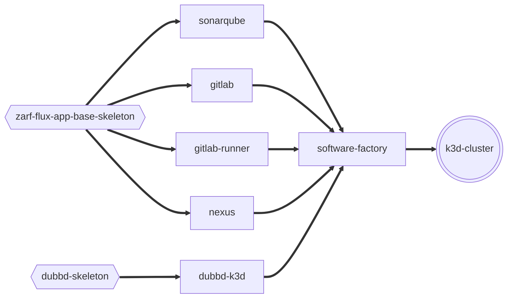

# uds-software-factory-experimental

An experiment with UDS Software Factory concepts.

>>>**Could be broken, could work perfectly fine. I break things, then fix them, then break them and fix them again**

>**If you want read access to the packages used to deploy this example just let me know. They currently live in my personal github registry**

## Diagram



## This example contains
- Copy of a core dubbd, published as a *skeleton* package and used by a k3d config built and published for use in this example
- zarf-flux-app-base package published as a *skeleton* for use in this example (imported by gitlab, gitlab-runner, sonareqube and nexus)
- gitlab zarf package package published for use in this example
- gitlab-runner zarf package published for use in this example
- sonarqube zarf package published for use in this example
- nexus zarf package published for use in this example
- software-factory zarf package that combines all this and is published for use in this example


## Pre-req
- Minimum compute requirements for single node deployment are at LEAST 64 GB RAM and 32 virtual CPU threads (aws `m6i.8xlarge` instance type should do)
- k3d installed on machine

## Use zarf to login to the needed registries i.e. registry1.dso.mil and ghcr.io

```bash
# Download Zarf
make build/zarf

# Login to the registry
set +o history

# registry1.dso.mil (To access registry1 images used during build time in this example)
export REGISTRY1_USERNAME="YOUR-USERNAME-HERE"
export REGISTRY1_TOKEN="YOUR-TOKEN-HERE"
echo $REGISTRY1_TOKEN | build/zarf tools registry login registry1.dso.mil --username $REGISTRY1_USERNAME --password-stdin

# ghcr.io (To access oci packages used in this example)
export GH_USERNAME="YOUR-USERNAME-HERE"
export GH_TOKEN="YOUR-TOKEN-HERE"
echo $GH_TOKEN | build/zarf tools registry login ghcr.io --username $REGISTRY1_USERNAME --password-stdin

set -o history
```

## Deploy the software factory
- Create and Init a k3d cluster
```bash
# This will create a compatible k3d cluster and deploy a compatible zarf init package
make create-and-init-k3d-cluster
```
- Deploy the software factory
```bash
# This will deploy the "Software Factory" which contains gitlab, gitlab-runner and sonarqube running on top of DUBBD (Defense Unicorns Big Bang Distro)
make deploy/software-factory
```

## More
The Makefile has other build publish and deploy targets. But its all pointing to my personal registry.
